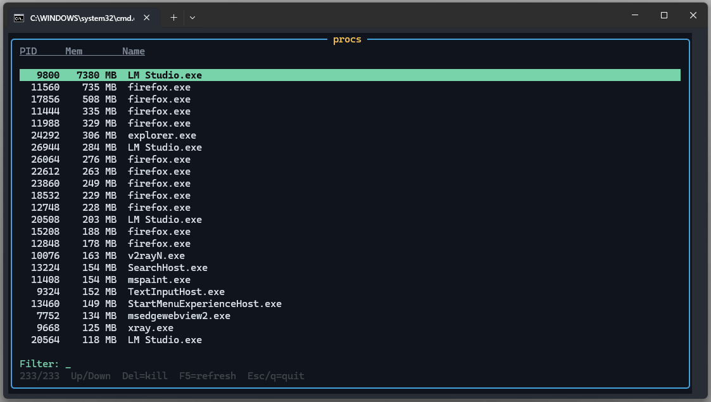

# OpenTUI C++ demo

Minimal **C++** samples that drive [OpenTUI](https://github.com/anomalyco/opentui)’s native Zig core through its **C ABI** — no TypeScript, React, or Bun runtime required.

<p align="center">
  
</p>

## What this is

OpenTUI ships a high-performance terminal renderer written in Zig. Official bindings target JS/TS, but the core library exposes a **C ABI** (`createRenderer`, buffer draw calls, `render`, …) so any language that can call C can use it.

This repo demonstrates that path on **Windows x64**:

| Target | Binary | Purpose |
|--------|--------|---------|
| `opentui_demo` | `opentui_demo.exe` | Smoke test: box, colors, frame counter, resize |
| `opentui_procs` | `opentui_procs.exe` | Process browser: filter, navigate, kill |

Shared helpers live in `otui_app` (console VT setup, keyboard input, resize sync).

To bootstrap or upgrade a C++ OpenTUI wrapper for any native-core version, follow the portable skill in [`skills/opentui-cpp-abi/`](skills/opentui-cpp-abi/) (agent-agnostic; start at `SKILL.md`).

## How it works

```text
┌─────────────────────┐
│  C++ app            │  demo.cpp / procs.cpp
│  (layout + input)   │
└─────────┬───────────┘
          │  C ABI (opentui.h)
          ▼
┌─────────────────────┐
│  opentui.dll        │  Zig native core
│  (buffers, ANSI)    │  from @opentui/core-win32-x64
└─────────┬───────────┘
          │  stdout / ConPTY
          ▼
┌─────────────────────┐
│  Terminal           │
└─────────────────────┘
```

1. CMake downloads the prebuilt Windows DLL (`scripts/fetch_opentui.ps1`) and generates an MSVC import library from its exports (`scripts/gen_implib.ps1`).
2. Apps link that DLL and include a hand-written header: [`include/opentui.h`](include/opentui.h).
3. Native objects are **opaque `uint32_t` handles** (not raw pointers). Handle `0` is invalid.
4. Each frame: `getNextBuffer` → draw (`bufferClear` / `bufferDrawBox` / `bufferDrawText`) → `render`.
5. Keyboard input and console resize are handled in C++ (Win32). After `setupTerminal`, Kitty keyboard / modifyOtherKeys are disabled so classic keys keep working.
6. `syncRendererSize` polls the console window size and calls `resizeRenderer` when it changes.

## Using the C ABI

Typical lifecycle:

```cpp
#include "opentui.h"

OtuiHandle renderer = createRenderer(
    width, height,
    OTUI_DEST_STDOUT,   // write ANSI to stdout
    OTUI_REMOTE_LOCAL,
    nullptr);
if (!renderer) {
    // createRenderer failed
}

setUseThread(renderer, false);
setupTerminal(renderer, true);  // alternate screen + capability queries

OtuiRGBA fg{}, bg{};
otui_rgb(fg, 255, 200, 80, 255);
otui_rgb(bg, 16, 20, 28, 255);

OtuiHandle buffer = getNextBuffer(renderer);
bufferClear(buffer, bg);
bufferDrawText(buffer,
               reinterpret_cast<const uint8_t *>("Hello"), 5,
               /*x=*/2, /*y=*/1, fg, bg, OTUI_ATTR_BOLD);
render(renderer, true);

destroyRenderer(renderer, true);
```

### Colors

Colors are packed `uint16_t[4]` (RGBA). For plain RGB, store each 8-bit channel in the **low byte** (`otui_rgb` does this). High bytes carry optional metadata (indexed / default intent) used by the Zig core.

### Boxes

`bufferDrawBox` expects an **11-element** border charset, in this order:

`topLeft`, `topRight`, `bottomLeft`, `bottomRight`, `horizontal`, `vertical`, `topT`, `bottomT`, `leftT`, `rightT`, `cross`

See `otui_app::kRoundedBorder` in [`include/otui_app.hpp`](include/otui_app.hpp).

### Relation to TypeScript

TypeScript OpenTUI wraps the same native ABI with classes and optional React/Solid reconcilers. This project calls the exported symbols directly — lower level, same renderer and buffer model.

Upstream ABI source of truth: [`packages/native/src/lib.zig`](https://github.com/anomalyco/opentui/blob/main/packages/native/src/lib.zig).

## Build (Windows)

Requirements:

- CMake ≥ 3.20
- MSVC (use a Visual Studio Developer shell so `cl`, `dumpbin`, and `lib` are on `PATH`)
- npm (to fetch `@opentui/core-win32-x64`)

```bat
cmake -S . -B build -G "NMake Makefiles" -DCMAKE_BUILD_TYPE=Release
cmake --build build
```

The DLL is fetched into `third_party/opentui/` (gitignored) and copied next to the executables under `build/`.

## Run

Use a real console window (not a redirected pipe):

```bat
run.bat
run_procs.bat
```

Or:

```bat
build\opentui_demo.exe
build\opentui_procs.exe
```

### `opentui_demo`

Shows a framed panel with frame count, elapsed time, and terminal size. Press `q` or `Esc` to quit.

### `opentui_procs`

| Key | Action |
|-----|--------|
| Type | Filter by name / PID |
| ↑ ↓ / PgUp PgDn | Move selection |
| `Del` | Kill selected process |
| `F5` | Refresh list |
| `Esc` | Clear filter, or quit if filter is empty |
| `q` | Quit |

## Repository layout

```text
include/opentui.h       C ABI declarations
include/otui_app.hpp    Shared console / input / resize helpers
src/otui_app.cpp
src/demo.cpp            opentui_demo
src/procs.cpp           opentui_procs
scripts/                DLL fetch + import-lib generation
skills/opentui-cpp-abi/ Portable skill: bootstrap / upgrade C++ ABI wrappers
img/opentui_procs.png   Screenshot
```

## Notes

- Pinned native package: `@opentui/core-win32-x64@0.5.10`.
- This is an imperative buffer-API demo, not the React/Solid component layer.
- The same C ABI works with `libopentui` on Linux/macOS; this tree is wired for Windows MSVC first.
